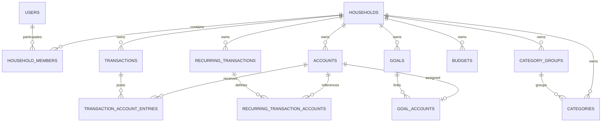

# ERD

## 개념 ERD



## 테이블

1. `users`
2. `households`
3. `household_members`
4. `accounts`
5. `category_groups`
6. `categories`
7. `transactions`
8. `transaction_account_entries`
9. `recurring_transactions`
10. `recurring_transaction_accounts`
11. `budgets`
12. `goals`
13. `goal_accounts`

## 핵심 관계

- User와 Household는 Member로 연결한다.
- 모든 재무 엔티티는 Household를 직접 가진다.
- Transaction은 경제 사건이고 Entry는 계좌 변화다.
- Goal은 Account를 연결하며 별도 잔액을 갖지 않는다.
- Recurring 규칙은 실제 Transaction을 생성하기 전까지 잔액에 영향을 주지 않는다.

## Slice 1 물리 schema

`V2__users_households.sql`은 다음 세 table만 구현한다.

```text
users
  id, email, display_name, status, created_at, updated_at

households
  id, name, base_currency, timezone, created_at, updated_at

household_members
  id, household_id, user_id, role, joined_at
```

- `users.email`은 저장 시 normalized lower-case이며 `LOWER(email)` unique index를 가진다.
- `household_members`는 `(household_id, user_id)` unique와 `role = 'OWNER'` partial unique index를 가진다.
- V1의 최대 2명 규칙은 다중 행 제약이므로 locked service transaction과 PostgreSQL 통합 테스트로 보완한다.
- password, 자체 credential, Account/Transaction table은 V2에 없다.

## Slice 3 물리 schema

`V3__accounts_categories_transactions.sql`은 다음 table을 추가한다.

```text
accounts
  id, household_id, name, institution, type, nature, ownership,
  owner_member_id, opening_balance, opening_balance_as_of, currency,
  last_four, savings_enabled, sort_order, archived_at, timestamps

category_groups
  id, household_id, name, type, sort_order, archived_at, timestamps

categories
  id, household_id, group_id, name, type, icon_key, color_key,
  sort_order, archived_at, timestamps

transactions
  id, household_id, type, amount, scope, owner_member_id, payer_member_id,
  category_id, occurred_at, memo, adjustment_type, reverses_transaction_id,
  version, created_at/by, updated_at/by, deleted_at/by
```

`V4__transaction_account_entries.sql`은 다음 posting table을 추가한다.

```text
transaction_account_entries
  id, household_id, transaction_id, account_id, entry_role, balance_delta
```

`V5__credit_card_liability_constraint.sql`은 `accounts.type='CREDIT_CARD'`이면 nature가 반드시 `LIABILITY`이도록 additive CHECK를 추가한다. 과거에 잘못된 row가 있으면 자동 수정하지 않고 migration을 실패시킨다.

Account owner, Transaction owner/payer/audit, Category Group/Category type, Transaction/Category type, Entry/Transaction/Account는 모두 `household_id`를 포함한 composite FK로 연결한다. V3는 이 target을 위해 `household_members (id, household_id)` unique를 additive로 추가한다.

## Slice 5 물리 schema

`V6__budgets.sql`은 다음 table을 추가한다.

```text
budgets
  id, household_id, budget_month, scope, owner_member_id, category_id,
  amount, version, created_at, updated_at
```

- `budget_month`는 월 1일 DATE다.
- `amount`는 0 이상이며 미설정은 row 부재로 표현한다.
- PERSONAL만 owner가 필수이고 HOUSEHOLD/SHARED owner는 null이다.
- Member와 Category는 `(id, household_id)` composite FK로 tenant 경계를 강제한다.
- identity는 `(household_id, budget_month, scope, owner_member_id, category_id) UNIQUE NULLS NOT DISTINCT`다.
- Category가 나중에 archive돼도 Budget FK와 row를 유지한다.

## Slice 7 물리 schema

`V7__recurring_transactions.sql`은 다음 table과 additive Transaction lineage를 추가한다.

```text
recurring_transactions
  id, household_id, name, type, amount, scope, owner_member_id,
  payer_member_id, category_id, memo, frequency, interval_value,
  start_date, end_date, scheduled_local_time, auto_post, active,
  next_recurrence_date, version, created_at/by, updated_at/by

recurring_transaction_accounts
  id, household_id, recurring_transaction_id, account_id, entry_role

transactions 추가
  generated_from_recurring_id, recurrence_date
```

- Recurring/Member/Category/Account/audit reference는 Household composite FK로 tenant 경계를 강제한다.
- INCOME/EXPENSE는 PRIMARY, TRANSFER는 SOURCE/DESTINATION template role exact set을 Service가 강제한다.
- template Account에는 delta를 저장하지 않고 실제 Transaction 생성 시 canonical posting 규칙으로 계산한다.
- generated lineage 두 column은 함께 null 또는 함께 값이며 generated row는 NORMAL이다.
- `(generated_from_recurring_id, recurrence_date)` full unique는 논리삭제 row도 포함한다.
- rule row는 ended/paused 뒤에도 history와 audit을 위해 유지한다.

## Slice 8 물리 schema

`V8__goals.sql`은 다음 table을 additive로 추가한다.

```text
goals
  id, household_id, type, name, target_amount, version,
  created_at/by, updated_at/by

goal_accounts
  goal_id, account_id, household_id, starting_balance,
  linked_at, linked_by
```

- `goals (id, household_id)`와 기존 Account/Member composite key로 모든 참조의 tenant 경계를 강제한다.
- Household의 `MARRIAGE`만 partial unique index로 한 개를 보장하고 future `CUSTOM` 여러 개는 닫지 않는다.
- `goal_accounts`는 `(goal_id, account_id)` PK와 전체 `account_id` unique로 한 Account의 중복 Goal 할당을 막는다.
- `starting_balance`는 연결 시 audit snapshot이며 현재 금액 aggregate column이 아니다.
- Goal 계산 결과, 월별 aggregate, contribution table과 근거 없는 조회 index는 추가하지 않는다.

## 구현 순서

전체 테이블을 한 migration에 만들지 않는다. Slice별 migration으로 진화하되 최종 제약은 이 ERD와 일치해야 한다.
