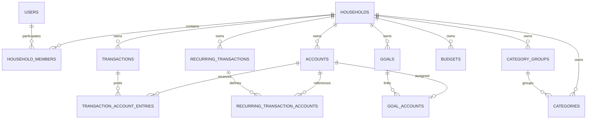

# ERD

## 개념 ERD



## 테이블

1. `users`
2. `households`
3. `household_members`
4. `accounts`
5. `category_groups`
6. `categories`
7. `transactions`
8. `transaction_account_entries`
9. `recurring_transactions`
10. `recurring_transaction_accounts`
11. `budgets`
12. `goals`
13. `goal_accounts`

## 핵심 관계

- User와 Household는 Member로 연결한다.
- 모든 재무 엔티티는 Household를 직접 가진다.
- Transaction은 경제 사건이고 Entry는 계좌 변화다.
- Goal은 Account를 연결하며 별도 잔액을 갖지 않는다.
- Recurring 규칙은 실제 Transaction을 생성하기 전까지 잔액에 영향을 주지 않는다.

## Slice 1 물리 schema

`V2__users_households.sql`은 다음 세 table만 구현한다.

```text
users
  id, email, display_name, status, created_at, updated_at

households
  id, name, base_currency, timezone, created_at, updated_at

household_members
  id, household_id, user_id, role, joined_at
```

- `users.email`은 저장 시 normalized lower-case이며 `LOWER(email)` unique index를 가진다.
- `household_members`는 `(household_id, user_id)` unique와 `role = 'OWNER'` partial unique index를 가진다.
- V1의 최대 2명 규칙은 다중 행 제약이므로 locked service transaction과 PostgreSQL 통합 테스트로 보완한다.
- password, 자체 credential, Account/Transaction table은 V2에 없다.

## Slice 3 물리 schema

`V3__accounts_categories_transactions.sql`은 다음 table을 추가한다.

```text
accounts
  id, household_id, name, institution, type, nature, ownership,
  owner_member_id, opening_balance, opening_balance_as_of, currency,
  last_four, savings_enabled, sort_order, archived_at, timestamps

category_groups
  id, household_id, name, type, sort_order, archived_at, timestamps

categories
  id, household_id, group_id, name, type, icon_key, color_key,
  sort_order, archived_at, timestamps

transactions
  id, household_id, type, amount, scope, owner_member_id, payer_member_id,
  category_id, occurred_at, memo, adjustment_type, reverses_transaction_id,
  version, created_at/by, updated_at/by, deleted_at/by
```

`V4__transaction_account_entries.sql`은 다음 posting table을 추가한다.

```text
transaction_account_entries
  id, household_id, transaction_id, account_id, entry_role, balance_delta
```

`V5__credit_card_liability_constraint.sql`은 `accounts.type='CREDIT_CARD'`이면 nature가 반드시 `LIABILITY`이도록 additive CHECK를 추가한다. 과거에 잘못된 row가 있으면 자동 수정하지 않고 migration을 실패시킨다.

Account owner, Transaction owner/payer/audit, Category Group/Category type, Transaction/Category type, Entry/Transaction/Account는 모두 `household_id`를 포함한 composite FK로 연결한다. V3는 이 target을 위해 `household_members (id, household_id)` unique를 additive로 추가한다.

## 구현 순서

전체 테이블을 한 migration에 만들지 않는다. Slice별 migration으로 진화하되 최종 제약은 이 ERD와 일치해야 한다.
