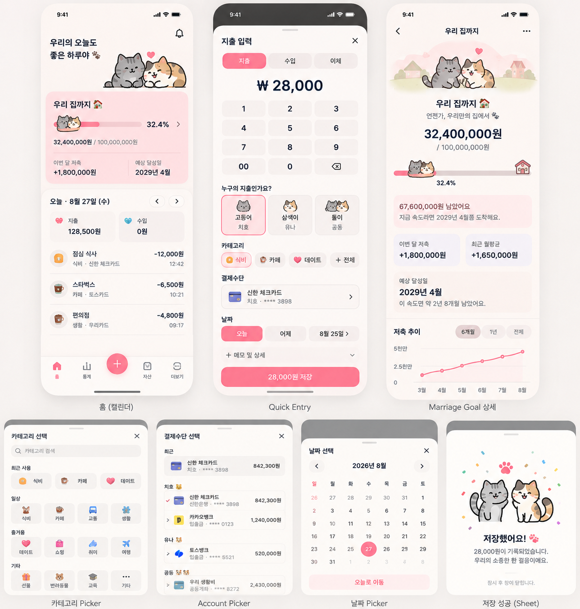

# Couple-first 디자인 시스템

## 상태와 적용 범위

이 문서는 Issue #8에서 확정한 visual direction의 활성 계약이다. 해당 화면이나 production illustration이 이미 구현됐다는 뜻은 아니다. 실제 component, token API, library 선택은 각 Slice에서 재검증하되 이 방향을 임의로 뒤집지 않는다.

## Concept

> 말랑한 핑크 다이어리 안에서 두 마리 고양이가 같이 돈을 모으는 느낌

- 금융 정보의 명확성 약 70%, 캐릭터와 감성 약 30%를 목표로 한다.
- 귀엽되 유아적으로 보이지 않게 한다.
- 금액, 상태, 거래 의미의 가독성이 illustration과 장식보다 항상 우선한다.

## Concept Mockup v1

- [repository 원본 asset](assets/concept-mockup-v1.png)
- 크기: `1224x1285` RGB PNG
- SHA-256: `00c7f02189893875ac815c3edad2f714b5df6bc063111fbc89c1ed835f34021e`
- 용도: 색감, 정보 밀도, 캐릭터 활용, 전체적인 시각 방향 참고
- 제외: production bundle용 asset, 실제 사용자 data, pixel-perfect layout 계약

mockup의 이름, 금액, 계좌 끝자리, navigation, 세부 배치는 예시다. 충돌할 때는 다음 순서로 판단한다.

1. Security와 financial data integrity
2. Accepted ADR와 domain/data 계약
3. 해당 Slice Issue 수용 기준
4. 최신 `docs/05-frontend` 구현 계약
5. Issue #8에 기록된 디자인 방향
6. Concept Mockup v1 이미지

## 기본 palette

| Token 방향 | 값 | 사용 방향 |
|---|---|---|
| `background` | `#FFF8FB` | app 배경 |
| `pink-100` | `#FFF0F5` | 약한 강조 배경 |
| `pink-200` | `#FFE1EC` | card와 선택 배경 |
| `pink-300` | `#FFC4D9` | 강조 border와 progress |
| `primary` | `#F36F9F` | 주요 action |
| `pressed` | `#E4588D` | 주요 action pressed 상태 |
| `accent-text` | `#C94275` | 강조 text |
| `neutral-0` | `#FFFFFF` | surface |
| `neutral-50` | `#FAF8F9` | 보조 surface |
| `neutral-100` | `#F3EEF0` | 구분 배경 |
| `neutral-300` | `#D9CED2` | border와 disabled 구분 |
| `neutral-500` | `#8D7D83` | secondary text 후보 |
| `neutral-700` | `#574A4F` | strong secondary text |
| `body` | `#30272A` | 본문과 핵심 숫자 |

최종 token naming과 contrast 조합은 실제 디자인 시스템 구현 시 검증해 확정한다. 이 표의 값만으로 접근성 충족을 단정하지 않는다.

## Semantic color

Semantic color는 pink palette와 분리한다.

| 의미 | 값 |
|---|---|
| `income` | `#3A9D78` |
| `expense` | `#E55E6D` |
| `transfer` | `#687BE5` |
| `savings` | `#8A6BC7` |
| `warning` | `#D7923C` |
| `danger` | `#D94B58` |

수입, 지출, 이체, 경고, 오류를 color만으로 전달하지 않는다. label, 부호, icon, 설명 중 필요한 중복 단서를 함께 제공한다.

## Cat identity

| 화면 identity | 표현 | 성격과 특징 |
|---|---|---|
| 치호 | 고등어냥 | 회색 고등어 태비, 차분하고 살짝 무심한 표정, 분홍 코와 귀 |
| 상대 Member | 삼색이 | 흰색·크림 base, 검정·주황 patch, 조금 더 밝은 표정, 필요할 때 작은 분홍 ribbon |
| `SHARED` | 두 고양이 | 두 identity를 함께 표시 |

- UI에는 API가 제공한 실제 Member 이름과 `공동` text를 명시한다.
- `ME`, `PARTNER`, 고양이 종류를 data model이나 API 식별자로 저장하지 않는다.
- Cat identity는 presentation layer 표현이며 authorization과 Household ownership 판단에 사용하지 않는다.
- mockup의 특정 상대 이름은 sample이며 모든 Household에 고정하지 않는다.
- cat illustration은 Couple header, Scope 선택, 저장 feedback, Marriage Goal hero와 milestone 같은 signature 순간에 제한한다.
- 모든 button, Category, transaction row에 고양이를 반복해 금융 정보의 밀도와 탐색성을 해치지 않는다.

## 접근성과 실제 data

- 실제 Member와 Account 이름이 길어져도 의미 있는 text를 숨기거나 고양이만 남기지 않는다.
- illustration에는 decorative 여부에 맞는 대체 text 정책을 적용하고 같은 정보가 본문에 있으면 중복 낭독을 피한다.
- mockup의 금융 숫자와 계좌 표시는 sample이다. 실제 전체 계좌번호, credential, private 금융 식별정보를 asset이나 문서에 넣지 않는다.
- animation과 interaction은 [Motion과 상호작용](interaction-motion.md)의 reduced-motion 계약을 따른다.

## 모바일 viewport와 입력 control

- form의 설명 label은 작은 보조 typography를 사용할 수 있지만 실제 `input`, `select`, `textarea`는 mobile에서 16px 이상을 유지한다.
- input focus 확대를 막기 위해 `maximum-scale=1`이나 `user-scalable=no`로 사용자 pinch zoom을 차단하지 않는다.
- 주요 화면과 Sheet는 `document.documentElement.scrollWidth <= window.innerWidth`를 만족해야 한다. 긴 이름, 큰 금액, native select의 min-content가 grid/flex track을 넓히지 않도록 해당 child를 shrink 또는 wrap한다.
- 전역 `overflow-x: hidden`으로 원인을 가리지 않는다. 의도된 component 내부 scroller와 page-level overflow를 구분하고 viewport를 침범하는 요소를 직접 수정한다.
- fixed Sheet와 하단 navigation은 viewport width 안에 두고 기존 `safe-area-inset-top`/`safe-area-inset-bottom` 및 필요한 세로 scroll을 보존한다.

## 공통 금액 입력

`AmountInput`은 입력과 동시에 `1000 → 1,000`, `1234567 → 1,234,567`처럼 표시한다. 화면별 formatter를 반복하지 않고 `amountInput.ts`의 문자열 parse/format을 공유한다.

- 화면 값은 formatted string, 부모 form state는 쉼표 없는 canonical string이다. 각 form의 기존 `Number(...)` 변환 뒤 API에는 JSON numeric value를 전송한다.
- 빈 입력 `''`와 `'0'`을 구분한다. `001000`은 `1000`으로 정규화하고 `1,000` 붙여넣기는 `1000`으로 해석한다.
- KRW 정수 입력에 숫자와 표시 구분자만 허용한다. 기초 잔액에만 기존 음수 입력을 허용한다. 문자·소수점·지수 표기·통화 기호를 섞은 변경은 전체를 거부하며 임의로 숫자만 잘라 다른 금액을 만들지 않는다.
- `type=text`, `inputMode=numeric`으로 쉼표 표시와 모바일 숫자 키보드를 함께 사용한다. required는 native form validation을 유지하고 min/max는 같은 경계의 custom validity와 각 form의 기존 submit/server 검증으로 보존한다.
- 입력·선택 범위는 숫자 위치를 기준으로 복원한다. Backspace/Delete가 구분자만 지웠을 때는 인접 숫자를 함께 지워 반복 삭제가 멈추지 않게 한다. 붙여넣기·전체 선택 후 재입력·빈 값·0 재입력을 지원한다.
- 긴 숫자도 formatter는 Number로 변환하지 않는다. 기존 API의 JavaScript number는 모든 BIGINT를 정확히 표현하지 못한다는 한계가 있으며, 이 표시 변경은 새 상한이나 별도 금융 계산 정책을 도입하지 않는다.
- 기존 16px 이상 control typography, element별 shrink/wrap, page horizontal overflow 방지와 Quick Category 중첩 Sheet의 draft/history/focus 계약을 유지한다.

### Monetary input inventory

frontend의 모든 `input`, `type="number"`, `inputMode`, amount/budget/target/refund/balance/principal/payment/money/won 참조를 조사한 결과다. 각 금액의 domain type은 KRW 정수이며 frontend API는 `number`, backend는 `Long/BIGINT`다.

| 화면/컴포넌트 | field와 mutation | 기존 input | required/null/zero 정책 | min/max | API payload field | 적용과 이유 |
|---|---|---|---|---|---|---|
| QuickEntrySheet | 금액, 거래 생성/수정, 지출/수입/이체 | number + numeric | 필수, 빈 값·0 거부 | 1 / 별도 UI max 없음 | transactions.amount | YES: 공통 거래 금액 |
| BudgetSheet | 예산 금액, 생성/수정 | number + numeric | 필수, 미설정 초기 빈 값, 0원 row 허용 | 0 / 별도 UI max 없음 | budgets.amount | YES: 미설정과 0원 구분 |
| RefundSheet | 환불 금액, 생성 | number + numeric | 필수, 빈 값·0 거부 | 1 / remainingRefundableAmount | transactions/{id}/refunds.amount | YES: 기존 누적 환불 상한 보존 |
| RecurringTransactionSheet | 반복 금액, 생성/수정 | number + numeric | 필수, 빈 값·0 거부 | 1 / 별도 UI max 없음 | recurring-transactions.amount | YES: 반복 template 금액 |
| MarriageGoalSheet | 목표 금액, 생성/수정 | number + numeric | 필수, 초기 빈 값, 0 거부 | 1 / 별도 UI max 없음 | goals/marriage.targetAmount | YES: 목표액 입력 |
| SettingsSheet AccountSetup | 기초 잔액, Account 생성 | number + numeric | UI optional, 초기 0, 빈 입력은 기존대로 0 전송, signed 허용, API null 금지 | 별도 UI min/max 없음 | accounts.openingBalance | YES: signed 원장 기초 잔액 |
| RecurringTransactionSheet | 반복 간격 | number | 필수 양수 | 1 / 별도 UI max 없음 | intervalValue | NO: 금액이 아닌 기간 횟수 |

입력 지점 6개 모두 적용한다. Assets/Statistics 잔액과 Goal 현재 보유금·연결 시 시작금액은 조회값이며 직접 입력 대상이 아니다. GoalAccountLinkSheet는 Account 선택만 제공하고 수동 기여금 입력을 만들지 않는다.

### 금액 입력 회귀 검증

`amountInput.test.ts`와 `AmountInput.test.tsx`는 빈 값·0·선행 0·1000·1234567·긴 숫자, required/min/max, signed 입력, 잘못된 변경 거부, 숫자 위치와 구분자 인접 삭제·선택 교체·paste를 검증한다. `App.test.tsx`는 6개 form의 표시/숫자 payload, Quick Entry 생성·수정과 Category draft 보존, Budget 생성·수정 및 미설정/0 구분, Refund 실제 상한, 반복 template, Goal, 기초 잔액 정책을 검증한다.

402×874, 393×852 viewport 검사는 jsdom과 별도로 수행한다. 브라우저 simulation을 실제 iPhone Safari/PWA 검증으로 간주하지 않으며 실기기 미수행 시 iPhone 16 Pro와 iPhone 15는 `OWNER_DEVICE_SMOKE_PENDING`으로 남기고 Draft PR을 유지한다.

## Slice 4 CSS 적용

Calendar Home은 이 palette를 CSS custom property로 구현한다. 작은 본문과 action의 실제 대비를 확보하기 위해 다음 text/semantic token은 문서의 초기 후보보다 어두운 값을 사용한다.

| 실제 token | 값 | 대표 대비 |
|---|---|---|
| `action-text` | `#241B1E` | `primary #F36F9F` 위 `6.07:1` |
| `accent-text` | `#B83267` | 흰색 위 `5.69:1` |
| `neutral-500` | `#76666C` | 흰색 위 `5.40:1` |
| `income` | `#2D805F` | text/icon 의미 보강 |
| `expense` | `#C84354` | text/icon 의미 보강 |
| `transfer` | `#5265C7` | text/icon 의미 보강 |
| `danger` | `#BD3344` | 오류 text 의미 보강 |

`body #30272A`와 `pink-200 #FFE1EC` 조합은 `11.89:1`이다. 수치 자체만으로 전체 화면 접근성을 단정하지 않고 날짜 button의 text label, 부호, 현재/선택 상태와 함께 검증한다. Slice 4는 CSS avatar placeholder만 사용하며 production 고양이 asset을 추가하지 않는다.

## 구현 library 후보

다음 항목은 실제 Slice에서 필요성, 기존 dependency, bundle 영향, 접근성을 다시 확인할 후보이며 Issue #8에서 설치하거나 채택을 확정하지 않는다.

- shadcn/ui와 Radix primitives: 접근 가능한 UI primitive가 실제로 필요한 경우
- Motion for React: CSS만으로 관리하기 어려운 motion이 검증된 경우
- Lucide React: 일관된 icon 체계가 필요한 경우
- TanStack Query: server state 동기화에 현재 구조보다 명확한 이점이 있는 경우
- React Hook Form과 Zod: form과 validation 복잡도가 도입 비용을 정당화하는 경우
- Recharts: Marriage Goal의 접근 가능한 월별 추이 chart에 적합한 경우
- Sonner: 별도 toast 체계가 필요한 경우
- dnd-kit: 사용자가 직접 reorder해야 하는 계약이 실제로 생긴 경우에만

library 수를 늘리는 것 자체는 목표가 아니다.
